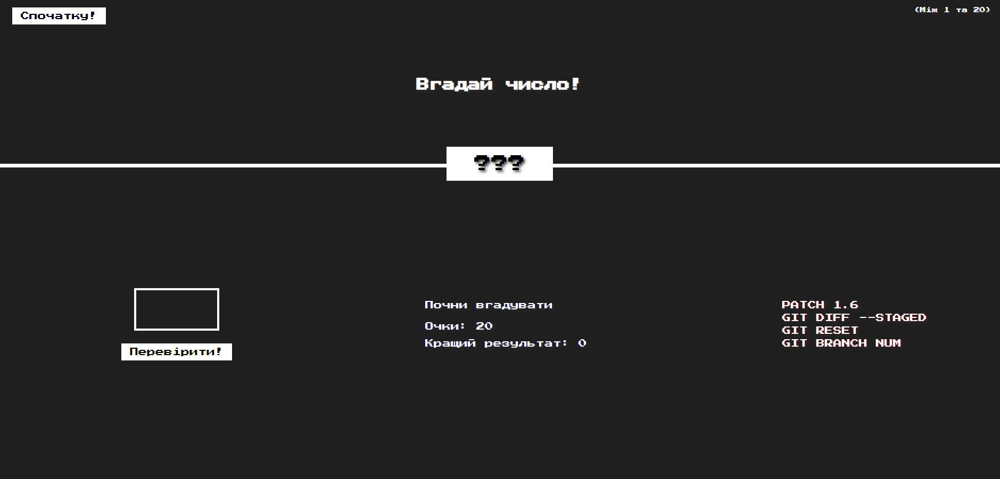

# Welcome to GitHub Desktop test project !

All the most important types of GitHub code are used here.

## Usage
Branching
Create a new branch:

shell

git branch <branch name>
Switch to an existing branch:

shell
git checkout <branch name>
View the list of branches:

shell
git branch
Commits
Add changes to the index:

shell
git add <file path>
Create a commit:

shell
git commit -m "Description of changes"
View commit history:

shell
git log
Merging
Merge branches:

shell
git merge <branch name>
Remote Repositories
Add a remote repository:

shell
git remote add origin <remote repository URL>
Push changes to a remote repository:

shell
git push origin <branch name>
Pull changes from a remote repository:

shell

git pull origin <branch name>
Ignoring Files
Create a .gitignore file to ignore specific files or directories. Add file patterns that you want to ignore.
